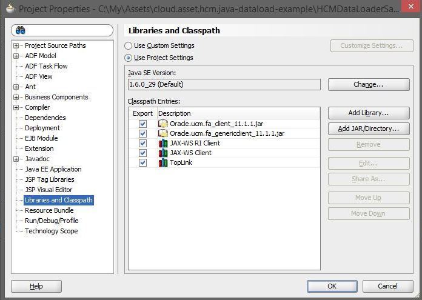

# HCM Data Loading using Java Example

This repository contains source code giving an example of how to load data into Oracle HCM using pure java.  This sample code was developed using JDeveloper however can easily be imported into other IDEs such as Eclipse and NetBeans.

This specific example loads data from a CSV file which contains Worker and User information unified in a single line. The sample code can easily be extended to manage other objects

The sample code : 

- Examines a directory looking for one , or more, CSV files
- Reads the CSV file and extracts out the **Worker** and **User** data
- **"Flattens"** the data , so that if there are multiple operations to a single data object (e.g. a User) the data is flattened so that only one operation is executed in HCM
- Generates a number of HDL files
- Creates a ZIP version of the HDL file(s) into a single zip file
- Loads the data into Oracle UCM, embedded within Oracle HCM
- Executes a call to Oracle HCM which requests Oracle HCM processes the files in UCM
- Polls HCM Services waiting for the HCM file to be loaded and processed by Oracle HCM
- Finally queries and checks to see if there were any errors with the data load

**Configuration Files**

This sample stores its preferences in two locations, the first one is the **hcmimport.properties** file which is normally held in the root of the classloader (in this project it is the **classes** directory). 

The second location is in the **HcmImportConstants.java** file, these are properties which would change rarely and hence are held in code.

# Installation

- Install JDeveloper 11g version 11.1.1.9, this is downloadable from Oracle OTN Website. 

- Obtain the Oracle UCM Java Jar files from Oracle OTN Website

  - Navigate to http://www.oracle.com/technetwork/middleware/webcenter/content/downloads/wcc-11g-downloads-2734036.html
  - Expand **Individual Component Downloads** and download **WebCenter Content Document Transfer Utility**
  - When its downloaded, unzip and locate these jar files and note down their locations
    - **oracle.ucm.fa_genericclient_11.1.1.jar**
    - **oracle.ucm.fa_client_11.1.1.jar**

- Startup Oracle JDeveloper Open 

  - Open the **HCMLoaderSample.jws** Application Workspace

  - Right Mouse Click on the HCMDataLoaderSample and select Properties

  - Select the libraries and Classpath entry

    - Within this tree you should have five libraries listed

      

    - The first two jar files are likely to be highlighted in RED as the paths won't match what is stored in the project, simply add the files using the add library button and then remove the erroneous entries

- Using the **Build** menu option , select "Make all" to compile the project

- Create a java keystore file with the Oracle Fusion certificate, see this 

  [https://www.youtube.com/watch?v=syTdkkzx8MU]: https://www.youtube.com/watch?v=syTdkkzx8MU

- Copy  **hcmimport.properties.sample**) file to the classes directory and rename this file to hcmimport.properites

- The hcmimport.properties file contains many runtime parameters which can be changed without recompiling the  code

| Property Name                         | Notes                                                        |
| ------------------------------------- | ------------------------------------------------------------ |
| FUSION_USERNAME                       | Username of a user which can load data. This user MUST have integration specialist role in HCM, e.g. HCM_IMPL |
| DATAPATH                              | This directory contains the location of data files that the program will process. This directory should have a "in" and "out" subdirectory, Place incomming data files into the in directory |
| FUSION_HCM_INSTANCE_URL               | URL to Fusion HCM instance Data Loading  Service. e.g.  https://xxxx.yyy.com/hcmCommonDataLoader/HCMDataLoader?wsdl |
| HCM_DATA_LOADER_SERVICE_WSDL_LOCATION | URL to the hcmCommonDataLoader service.  e.g.  https://xxxx.yyy.com/idcws/GenericSoapPort |
| UCM_IDC_WEBSERVICE_LOCATION           | URL to the UCM WebService Location                           |
| KEYSTORE_LOCATION                     | Location of keystore, which contains the Fusion Applications ssl certificate [Optional] |
| KEYSTORE_ALIAS                        | Alias of keystore (often orakey)  [Optional]            |
| GETDATASETSTATUS_DELAY                | Poll frequency when requesting dataset status. For testing set low (e.g. 5seconds) for production you should set this higher (e.g. 60 seconds) |
| CSV_FILE_ENCODING                     | Encoding of CSV file                                         |
| DATA_SEPERATOR                        | CSV file encoding, usually "," or ";"                        |

- Modify the file as needed

# Running the sample

This example code takes a CSV file which contains lines of User and Worker data in a single line and subsequently creates HDL imports for both the user and worker. Before running the example ensure that

1. The default constants in HcmImportConstants.java and WorkerDataRow.java match your environment and data file format
2. You complete the hcmimport.properties file with information matching your environment
3. The entire sample code compiles with no errors

To run the file

1. Place a import file of the correct format in the **data/in**  directory
   - We have supplied a sample file called **sampleInputData.csv** as an example
2. Run the sample code by executing the HcmImport.java executable
3. For security reasons the sample code does **not store any passwords in password files or in the source code**, it does however prompt the user for the HCM user password when run on the command line. It is up to the developer to integrate the solution into their companies standard mechanism for managing passwords for batch programs, e.g. A security wallet or similar
4. Monitor the output for log messages
5. Processed files are then placed in  the **data/out** directory

# Extending the sample

This example specifically focuses on User and Worker objects. If you want to extend it you can by

- Adding additional Entities in *com.oracle.ateam.asset.hcmjavadataload.client.entities*
- Modifying the method *transformData*() in *com.oracle.ateam.asset.hcmjavadataload.client.HcmDataImport* to your requirements

For more information please see the following article

https://docs.oracle.com/en/solutions/load-data-into-hcm-cloud/index.html#GUID-2546E2DA-7B9A-475F-B953-17DC74F15427

### Authors

Angelo Santagata (ATeam Architect) and Ralf Buchmueller (EMEA Consulting Director)

